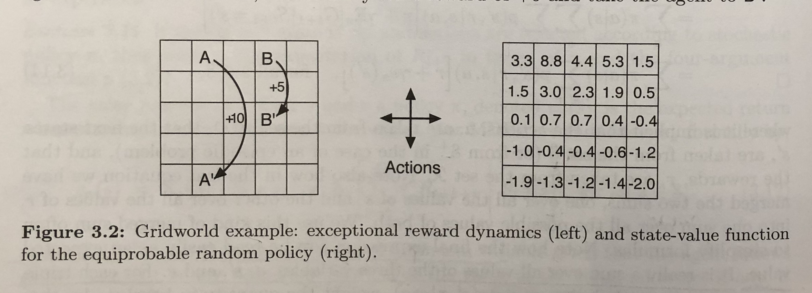

# Example 3.5 Gridworld

Figure (left) shows a rectangular gridworld representation of a simple finit MDP. The cells of the grid correspond to the states of the environment. At each cell, four actions are possible: _nord_, _south_, _east_, and _west_, which deterministically cause the agent to move one cell in the respective direction on the grid. Actions that would take the agent off the grid leave its location unchaged, but also result in a reward of _-1_. Other actions result in a reward of _0_, except those that move the agent out of the special states _A_ and _B_. From state _A_, all four actions yield a reward of _+10_ and take the agent to _A´_. From state _B_, all actions yield a reward of _+5_ and take the agent to _B´_.

Suppose the agent selects all four actions with equal probability in all states. Figure (right) shows the value function, $v_\pi$, for this policy, for the discounted reward case with $\gamma = 0.9$.

Notice the negative values near the lower edge; these are the result of the high probability of hitting the edge of the grid there under the random policy. State _A_ is the best state to be in under this policy, but its expected return is less than 10, its immediate reward, because from _A_ the agent is taken to _A´_, from which it is likely to run into the edge of the grid. State _B_, on the other hand, is valued more than 5, its immediate reward, because from _B_ the agent is taken to _B´_, which has a positive value. From _B´_ the expected penalty (negative reward) for possibly running into an edge is more than compensated for by the expected gain for possibly stumbling onto _A_ or _B_.
